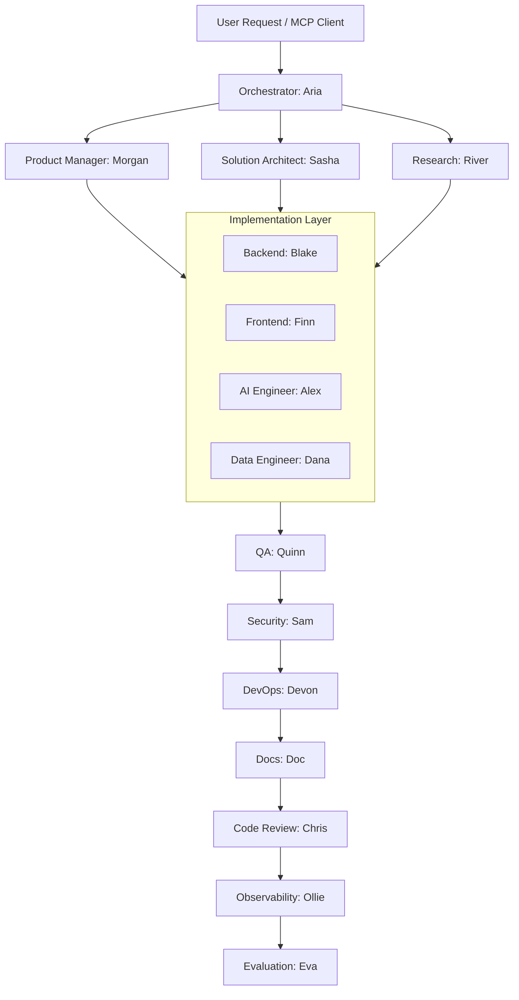

# OpenClaw — Local AI Engineering Organization

[](https://www.docker.com/)
[](https://www.python.org/)
[](https://fastapi.tiangolo.com/)
[](https://www.langchain.com/langgraph)
[-brightgreen)](#)

A **production-grade, 100% local AI Engineering Organization** where specialized AI agents collaborate to produce complete software applications — from requirements through deployment. It behaves like a software company composed of AI teammates, running entirely on your own machine without relying on external API keys.



## AI Models Configuration
The system leverages **LiteLLM** to seamlessly proxy and load balance requests to local Ollama models. You get the intelligence of a massive AI cluster completely for free:

- **Reasoning Agents** (Orchestrator, Solution Architect): `qwen2.5:32b`
- **Engineering Agents** (Backend, Frontend, DevOps, QA): `qwen2.5-coder:7b`
- **Fast Agents** (Research, Eval): `llama3.2:3b`

*To use this setup, ensure you pull the models on your host:*
```bash
ollama run qwen2.5:32b
ollama run qwen2.5-coder
ollama run llama3.2
ollama run nomic-embed-text
```

## Quick Start

```bash
# 1. Configure environment
cp .env.example .env

# 2. Start all infrastructure services
docker-compose up -d

# 3. Monitor your AI engineers via Langfuse
open http://localhost:3001
```

## MCP Server Integration
Expose the OpenClaw multi-agent cluster to your IDE (Cursor, Claude Desktop) via the built-in MCP server!

Add this to your `cline_mcp_settings.json` or Cursor Settings:
```json
{
  "mcpServers": {
    "openclaw-agents": {
      "command": "python",
      "args": ["mcp/servers/openclaw_server.py"]
    }
  }
}
```

## Architecture Services

| Service    | Port   | Purpose                       |
| ---------- | ------ | ----------------------------- |
| OpenClaw   | 8000   | Main API & WebSocket Gateway  |
| LiteLLM    | 4000   | Unified Local LLM router      |
| PostgreSQL | 5433   | Task state + memory           |
| Redis      | 6379   | Working memory + queues       |
| Qdrant     | 6333   | Semantic/vector memory        |
| Langfuse   | 3001   | AI Observability              |
| Grafana    | 3002   | System Dashboards             |
