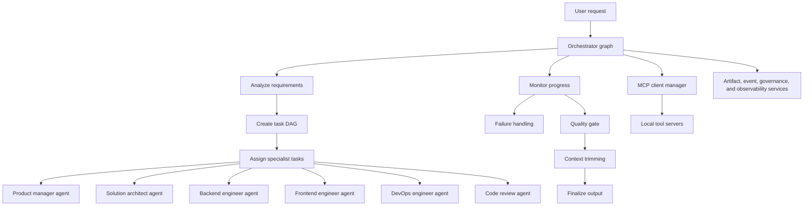

# OpenClaw

OpenClaw is a local AI-engineering organization prototype. It models a software-delivery team made of specialist agents, a LangGraph-style orchestrator, MCP tool-server wrappers, artifact persistence, eventing, observability, and quality-gate abstractions.

This repository is strongest as evidence of agent-platform architecture and orchestration design. It should not be read as a finished autonomous deployment platform, a production SaaS product, or a system with externally validated quality scores.

## What It Demonstrates

- Specialist-agent decomposition for product, architecture, backend, frontend, DevOps, review, evaluation, and observability roles.
- Orchestrated software-delivery workflow with planning, task DAG creation, assignment, monitoring, failure handling, quality gates, context trimming, and finalization.
- MCP client management for tool discovery and tool invocation through local server wrappers.
- Local infrastructure concepts for task state, artifact storage, event flow, and observability.
- Explicit boundaries between implemented prototype paths and future production hardening.

## Evidence Map

| Claim | Repository evidence |
| --- | --- |
| Multi-agent software-delivery workflow | `agents/orchestrator/graph.py` defines the orchestrator flow and workflow stages. |
| Specialist-agent architecture | The `agents/` package includes product, architecture, backend, frontend, DevOps, review, evaluation, observability, and orchestration modules. |
| MCP integration | `services/mcp_client_manager.py` manages tool listing and invocation through MCP server processes. |
| Quality-gate abstraction | The orchestrator includes a quality-gate stage, and `services/evaluation.py` provides an evaluation interface. Current scores are placeholders and must not be marketed as measured results. |
| Local platform services | Service modules cover artifacts, eventing, git governance, retry strategy, semantic cache, and architecture guard concerns. |

See `docs/CLAIM_AUDIT.md` for the full claim review.

## Architecture


```mermaid
graph TD
    Request[User request] --> Orchestrator[Orchestrator graph]
    Orchestrator --> Analyze[Analyze requirements]
    Analyze --> DAG[Create task DAG]
    DAG --> Assign[Assign specialist tasks]
    Assign --> PM[Product manager agent]
    Assign --> SA[Solution architect agent]
    Assign --> BE[Backend engineer agent]
    Assign --> FE[Frontend engineer agent]
    Assign --> DevOps[DevOps engineer agent]
    Assign --> Review[Code review agent]
    Orchestrator --> Monitor[Monitor progress]
    Monitor --> Failure[Failure handling]
    Monitor --> Quality[Quality gate]
    Quality --> Context[Context trimming]
    Context --> Finalize[Finalize output]
    Orchestrator --> MCP[MCP client manager]
    MCP --> Tools[Local tool servers]
    Orchestrator --> Services[Artifact, event, governance, and observability services]
```

## Key Implementation Areas

### Orchestration

The orchestrator graph models how a request moves through requirement analysis, task planning, assignment, monitoring, recovery, review, and final output preparation.

### Agent roles

The agent modules make role responsibilities explicit. This is useful portfolio evidence for designing multi-agent systems with clear ownership rather than a single unstructured assistant loop.

### MCP tool integration

The MCP client manager shows how local tool servers can be discovered and invoked from the orchestration layer. The README avoids claiming broad production automation beyond what the code path supports.

### Evaluation boundary

The repository includes an evaluation service and quality-gate stage, but current scoring logic is placeholder-style. The documentation now treats evaluation as an interface to be made reproducible, not as measured proof of output quality.

## Quick Start

```bash
cp .env.example .env
# Add required local provider keys/configuration.
docker compose -f docker-compose.dev.yml up -d
poetry run uvicorn backend.main:app --host 0.0.0.0 --port 8001 --reload
```

## Evaluation and Quality

This project should be evaluated as an agent-platform prototype until benchmark data is added. The recommended validation plan is documented in `docs/EVALUATION_PLAN.md` and covers:

- Workflow completion and recovery behavior.
- Tool-call auditability and failure handling.
- Artifact quality review using human-labeled rubrics.
- Security review of tool execution boundaries.
- Observability and trace completeness.

## Documentation

- `docs/CLAIM_AUDIT.md` documents which claims are supported, softened, or removed.
- `docs/EVALUATION_PLAN.md` defines a reproducible evaluation plan without inventing benchmark results.
- `docs/adr/0001-local-agent-organization-architecture.md` records the architecture decision and tradeoffs.

## License

See repository license files for licensing details.
